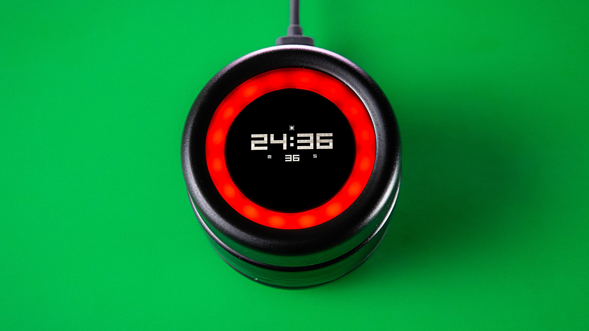

    

Watch the build video ↓

Tired of constant distractions, I built the Focus Dial—a DIY take on the failed TimeChi crowdfunding project. It helps me work in time blocks by activating a Do Not Disturb mode on my phone and integrates with Home Assistant via webhook triggers to set lighting scenes and block distracting apps at the network level during focus sessions.

Build instructions → [Instructables](https://www.instructables.com/Focus-Dial-a-Digital-Distraction-Blocker/)

[![CC BY-NC-SA 4.0][cc-by-nc-sa-shield]][cc-by-nc-sa]

[![CC BY-NC-SA 4.0][cc-by-nc-sa-image]][cc-by-nc-sa]

[cc-by-nc-sa]: http://creativecommons.org/licenses/by-nc-sa/4.0/
[cc-by-nc-sa-image]: https://licensebuttons.net/l/by-nc-sa/4.0/88x31.png
[cc-by-nc-sa-shield]: https://img.shields.io/badge/License-CC%20BY--NC--SA%204.0-lightgrey.svg